# Elevator Management System (EMS)

The Elevator Management System (EMS) is a system designed to model and organize
the operational processes of a service-based company, inspired by a real
elevator services context and built from limited initial information.

The purpose of this project is to translate real operational workflows into
a structured system that reflects how work is actually performed, rather than
to showcase technical complexity.

## What this project demonstrates
- Understanding a business domain with incomplete and evolving inputs
- Translating operational processes into structured system entities
- Defining relationships between clients, projects, personnel, and services
- Designing a system that supports operational visibility and control

## Operational context
Service-based companies often rely on fragmented tools such as spreadsheets,
emails, and manual tracking to manage projects and personnel.

This project explores how a single system can:
- Centralize operational information
- Reduce manual tracking and duplication
- Improve visibility of project and personnel status
- Support decision-making through structured data

The system design is based on real operational workflows rather than academic
or hypothetical requirements.

## My role
I approached this project from a system and operations perspective. My work
focused on:

- Analyzing operational processes and business rules
- Designing the system structure and data model
- Defining workflows aligned with real-world scenarios
- Validating system behavior against practical operational needs
- Iterating on the design as requirements evolved

While this project includes a working technical implementation, the primary
focus was on representing operational reality through a coherent system
structure.

## System overview
The system includes:
- Client, project, and personnel management
- Project assignment and status tracking
- Operational dashboards and reports
- A structured data model aligned with business workflows

Screenshots below illustrate the main system areas and flows.

### Login
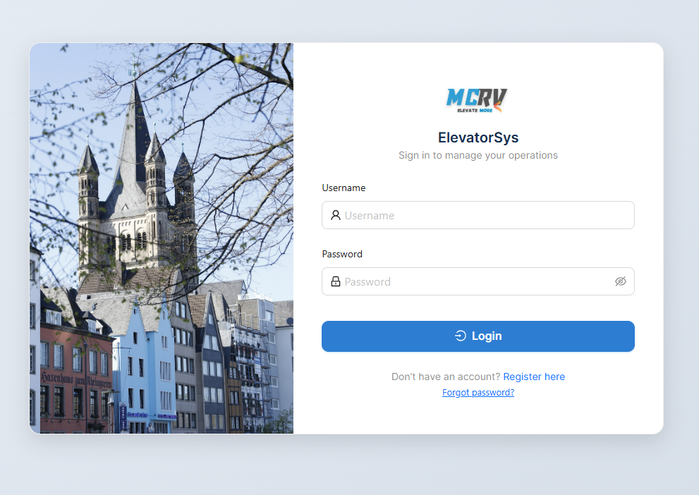

---

### Dashboard
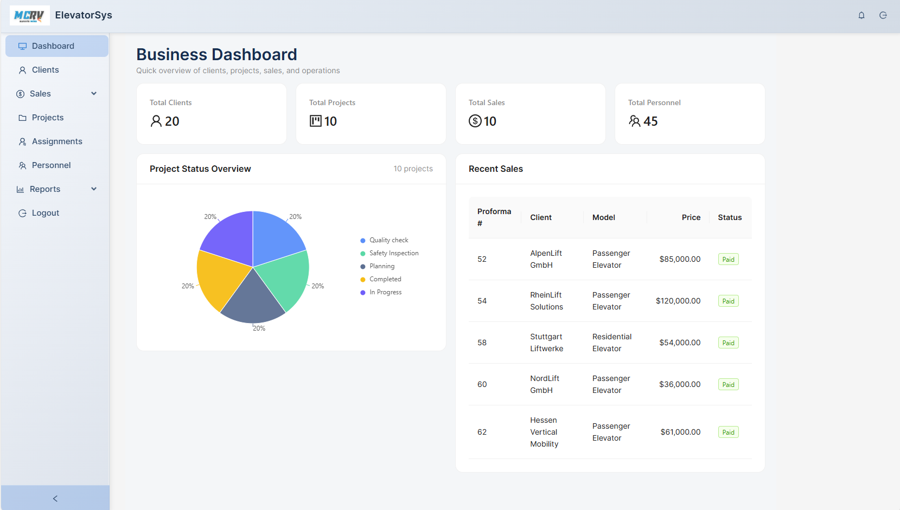

---

### Clients Management
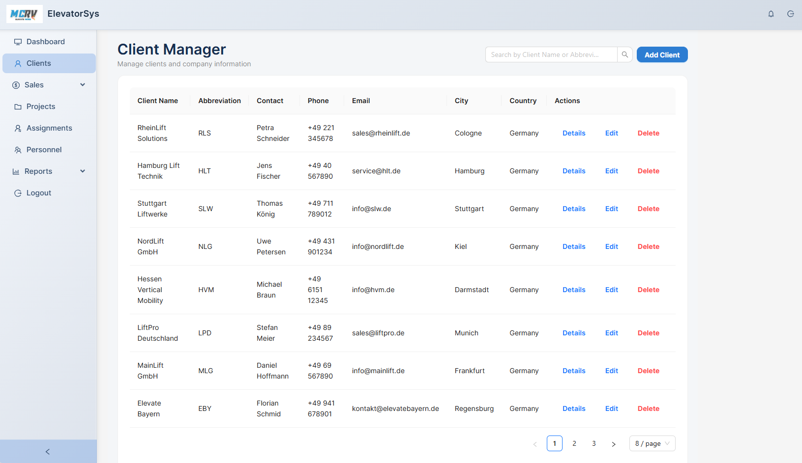

---

### Projects Management
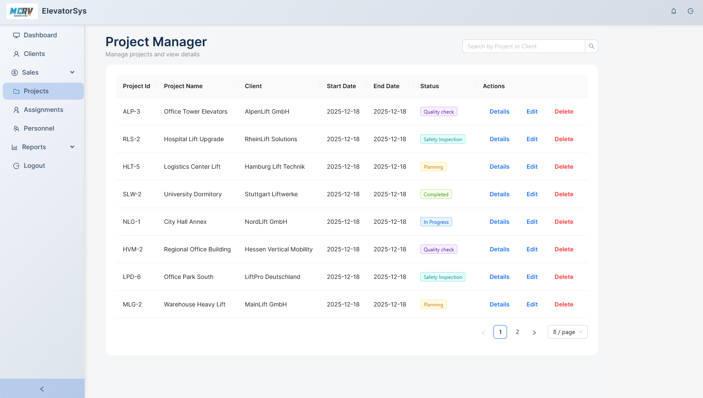

---

### Project Assignments
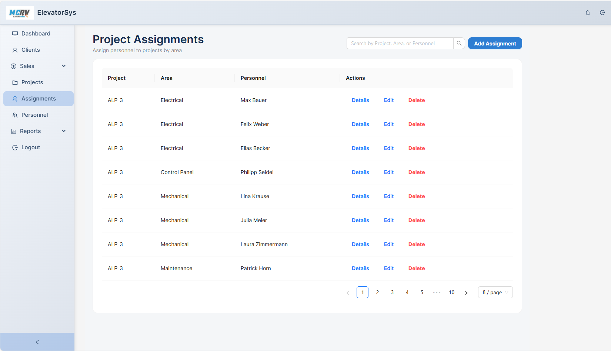

---

### Personnel Management
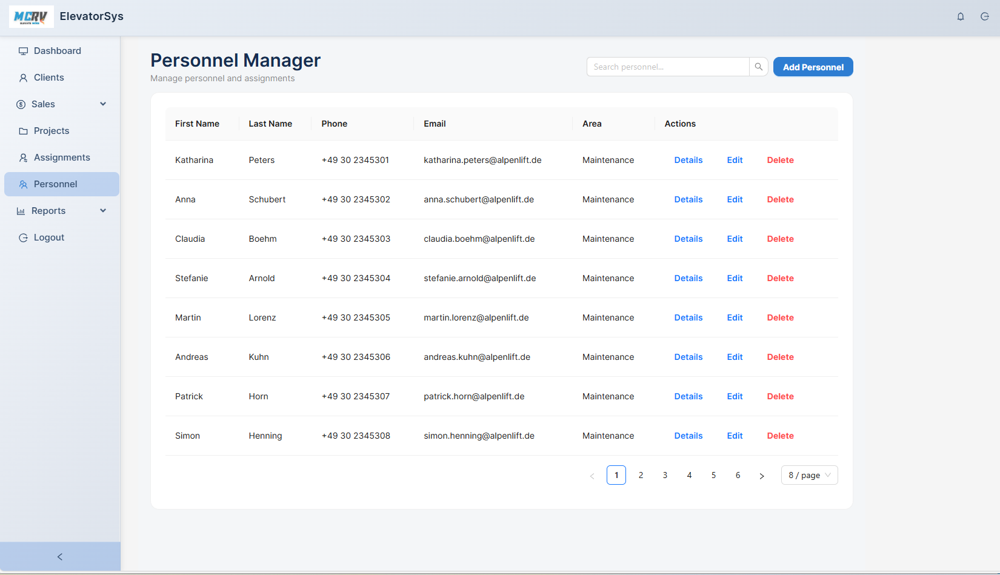

---

### Sales & Proformas
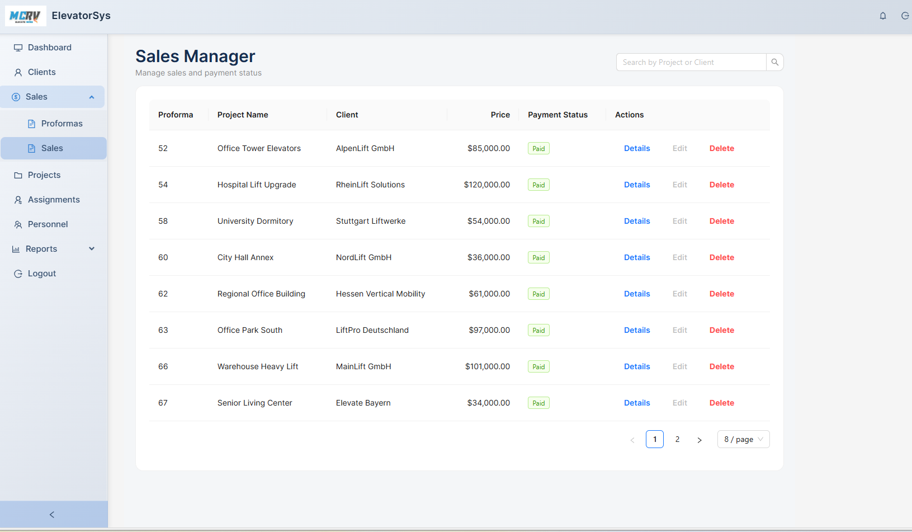

---

### Proformas Report
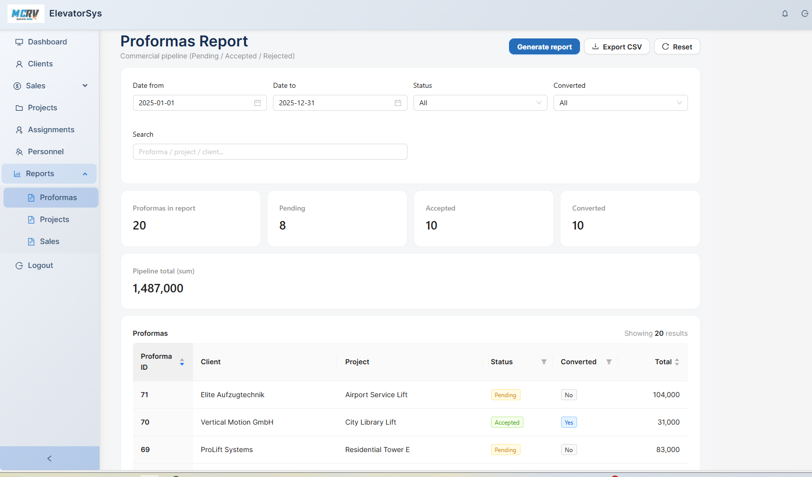

---

### Projects Report
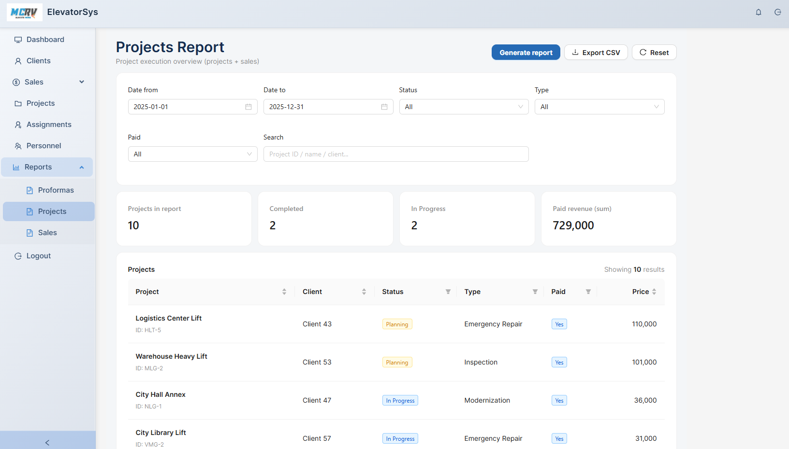

---

### Sales Report
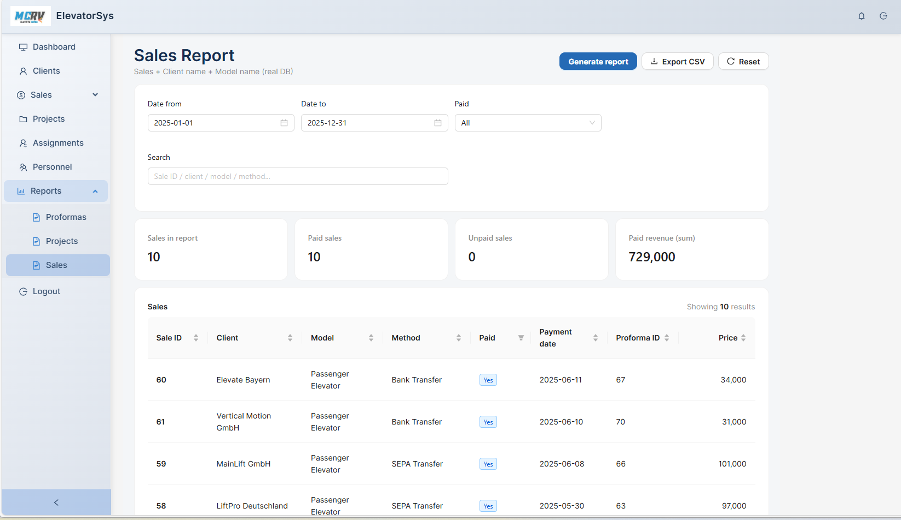

---

### Logout
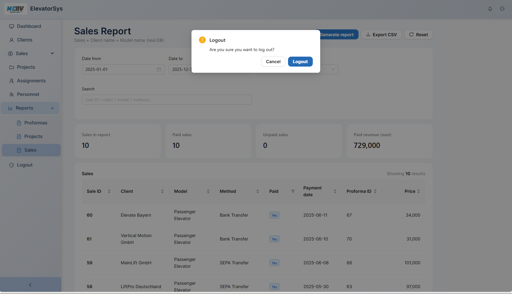

---

## System features

- User authentication and role-based access
- Centralized dashboard with operational overview
- Client registration and management
- Project tracking with status control
- Personnel management and assignment
- Structured data model designed around real operational needs

---

## Business Problem Addressed

Service-based companies often rely on fragmented tools (spreadsheets, emails, manual tracking) to manage projects and personnel.

This project explores how a single system can:
- Centralize operational data
- Reduce manual tracking
- Improve visibility of project status
- Support decision-making through structured information

The system design is based on real operational workflows rather than purely academic requirements.

---

## System Design (High level)

The system follows a simple full-stack architecture:
- Frontend for user interaction and data visualization
- Backend API handling business logic and data access
- Relational database modeling real-world entities and relationships

The focus is on clarity, maintainability, and alignment with business processes rather than advanced optimization.

---

## Technical notes (supporting layer)
The system was implemented using a modern full-stack architecture to support the operational design:

- Frontend: React, Ant Design
- Backend: Django REST Framework
- Database: PostgreSQL
- Deployment (prototype): Render (free tier)

Technology choices were made to support clarity, maintainability, and alignment with business processes.

## Project status
This project is a portfolio prototype intended to demonstrate system and process-oriented thinking.

Due to free-tier deployment limitations, the live backend and database may not always be available. The project is currently showcased through screenshots and documentation.

## Key takeaway
This project illustrates how operational understanding, process analysis, and system thinking can be combined to create structured solutions in environments where requirements are partial and constraints are real.

